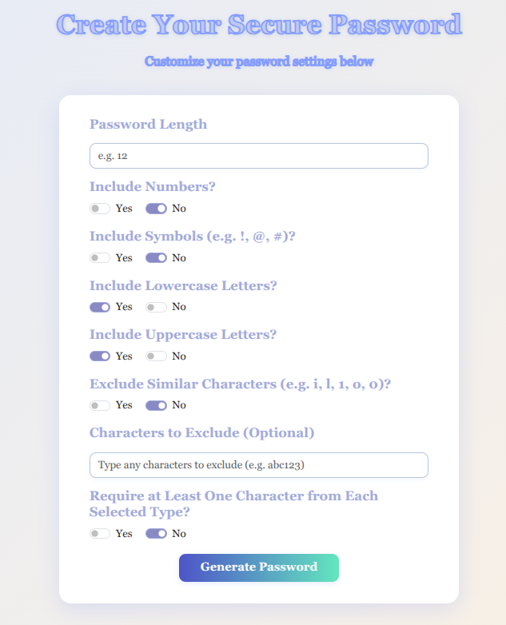
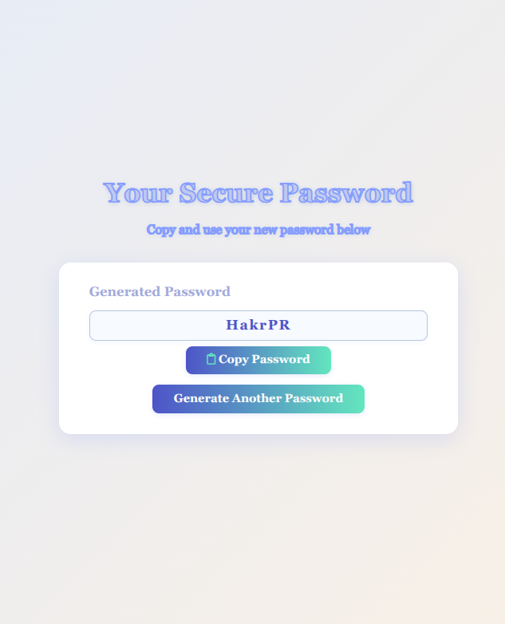

# Password Generator

A modern, customizable password generator web app built with Node.js and Express.  
Easily create secure passwords with your own settings and instantly copy them for use.

---

## Preview

### Password Generator Form



### Generated Password Page



---

## Features

- **Customizable Passwords:**  
  Choose length, include/exclude numbers, symbols, uppercase, lowercase, similar characters, and more.

- **Instant Copy:**  
  One-click copy for generated passwords.

- **Responsive & Attractive UI:**  
  Beautiful, modern design that works on all devices.

- **Error Handling:**  
  Friendly messages if you forget to select character types or enter invalid input.

---

## Getting Started

### Prerequisites

- [Node.js](https://nodejs.org/) (v14+ recommended)
- [npm](https://www.npmjs.com/)

### Installation

1. Clone the repository:

   ```bash
   git clone https://github.com/Imraninrcm/PasswordGenerator.git
   cd PasswordGenerator
   ```

2. Install dependencies:

   ```bash
   npm install
   ```

3. Start the server:
   ```bash
   node index.js
   ```
   The app will run on [http://localhost:8080](http://localhost:8080)

---

## Usage

1. Open the app in your browser.
2. Fill out the password settings form.
3. Click **Generate Password**.
4. Copy your password with one click and use it anywhere!

---

## Technologies Used

- Node.js
- Express.js
- EJS (Embedded JavaScript templates)
- Bootstrap 5
- Font Awesome

---

## Screenshots

See the preview images above for the form and result pages.

---

## License

MIT License

---

## Author

Made by [Imran Ali].  
Feel free to contribute
